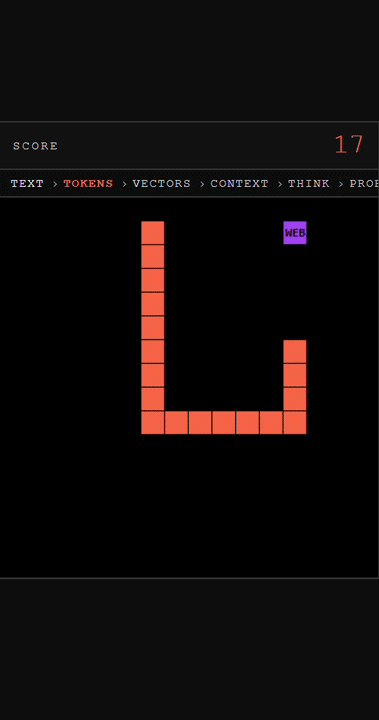

# Hi, I'm Caio

I'm an AI/ML engineer (Paris Dauphine, ENS, Écoles de Mines) interested in building scalable AI software. I focus on problems, means, and objectives* rather than just tech stack. I have worked across building ML systems for healthcare, educational technologies, generative AI and AR/VR for industry.

*~Maths, Statistics, and ML~. Pun intended :)

## 🐍 My portfolio lives inside a Snake game

Instead of a boring list of projects, I built a Snake game where each apple you eat reveals one of my repos.
The harder you play, the more you discover.

▶ **[Play it here](https://caiocrocha.github.io/snake-game)** — works on mobile too.

## Skills

Python • C++ • PyTorch • TensorFlow • LLMs • APIs • NLP • ASR • Computer Vision • Deep Learning • AWS • Google Cloud
